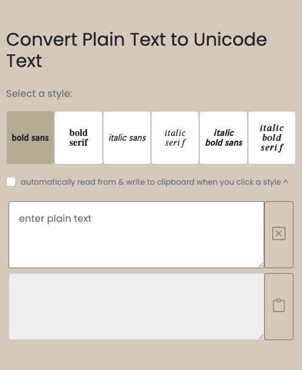
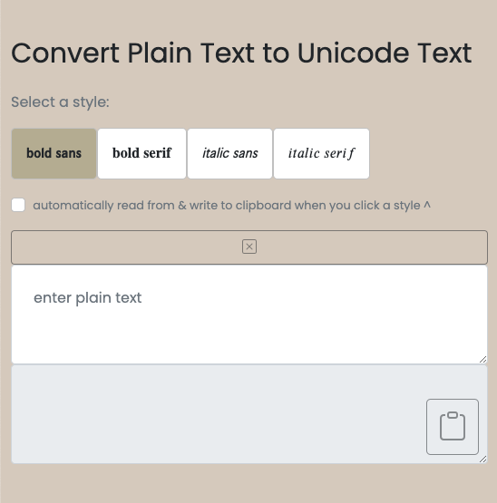

# [Deployed Site](https://tounicode.netlify.app/)



# Description

Convert your plain text to unicode! I built this for someone who wanted to style text on Google Keep, which lacks bold/italic options. (**NOTE: Unicode characters CANNOT be searched through.**)
Directions: First select a style, then enter some text, then copy the unicoded result, and lastly paste it into your app of choice (try this with iMessage for some fun!)

# Resources

- Bootstrap

# Inspiration

- [Bold Text Generator](https://lingojam.com/BoldTextGenerator)

# How it Works

When the user selects a style, a specific plainText-to-unicode object is selected as a reference.

```
{
    italic sans: {a: '𝘢', b: '𝘣', c: '𝘤', d: '𝘥', e: '𝘦', …},
    italic serif: {a: '𝑎', b: '𝑏', c: '𝑐', d: '𝑑', e: '𝑒', …},
    //etc
}
```

So if a user selects the 'italic sans' style, then this object `{a: '𝘢', b: '𝘣', ...}` will be used to convert plain text to unicode.

# Learned

- Boostrap: How to make a flexbox responsive
  - Eg: Change flex-direction from column to row at the sm breakpoint:
    - `d-flex`: Makes the container a flex box. (Default direction: row)
    - `flex-column`: Changes default direction to column.
    - `flex-sm-row`: Changes direction to row at the sm break-point

# Cleaner Code

I make an effort to make code easier to read.
In the following example, I originally had a comment explaining a function.
I renamed the function for more simplicity. I also reworked the function so that it accepts an argument to copy.  
The end result needs no explanation. Beautiful, isn't it?
``
//copy textarea2.value to clipboard  
onClick_copyToClipboardBtn();

```
`copyToClipboard(textarea2.value)`


# Evolution




```
